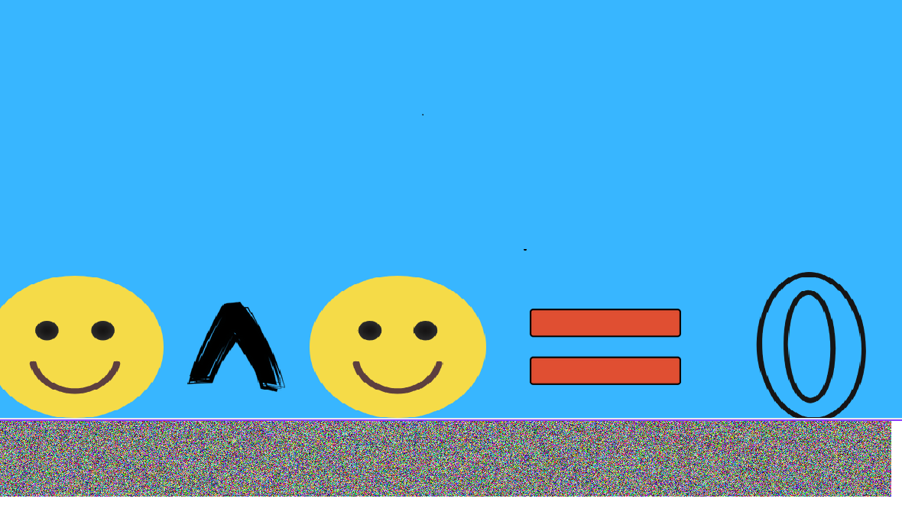
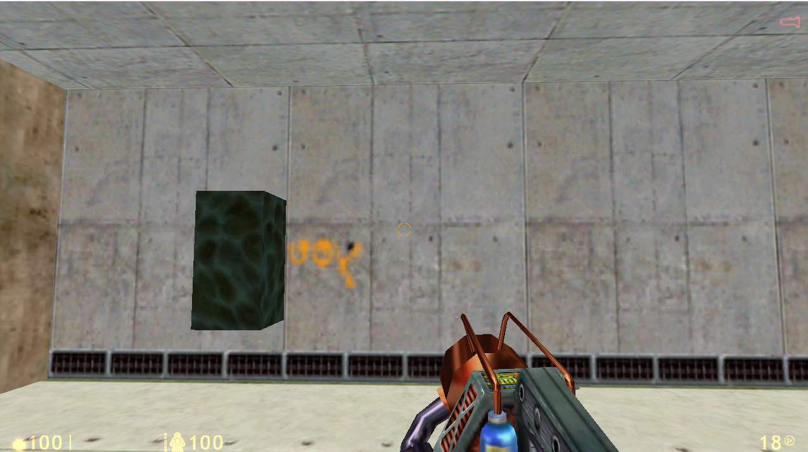
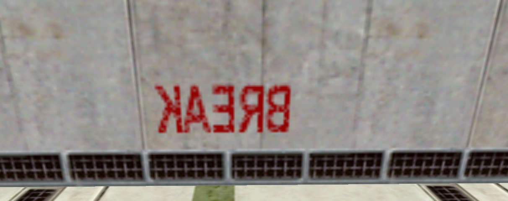
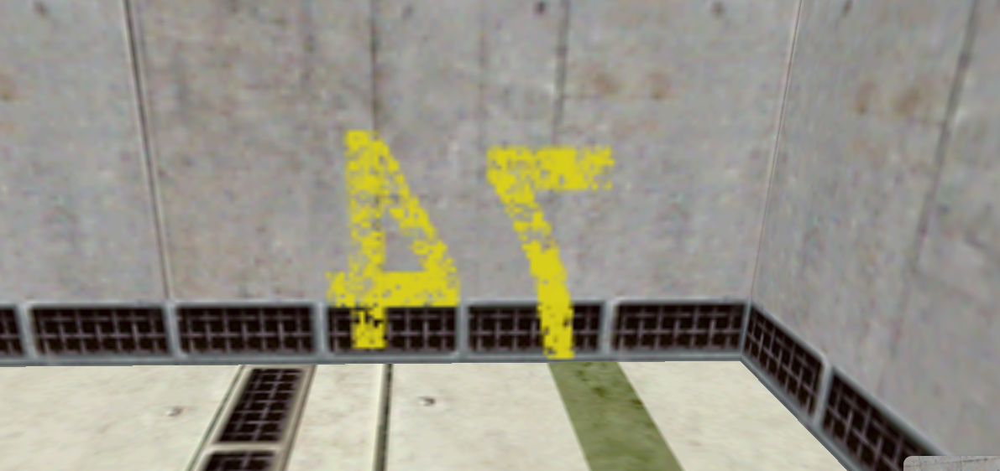
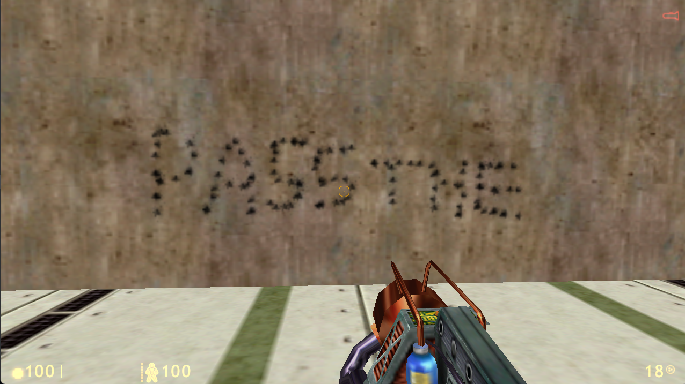
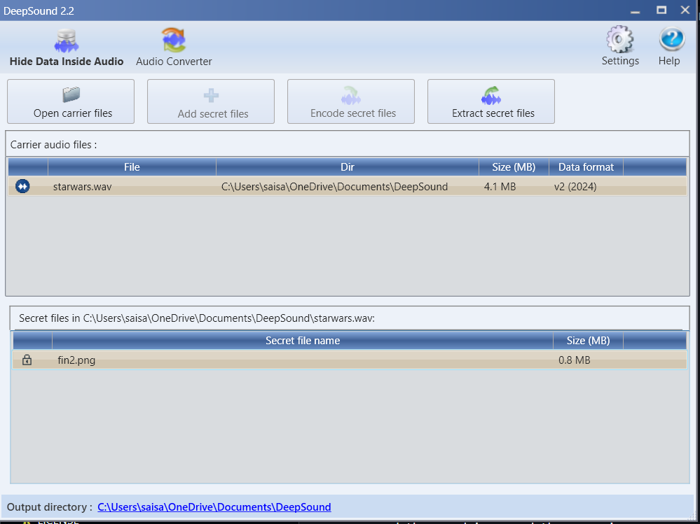
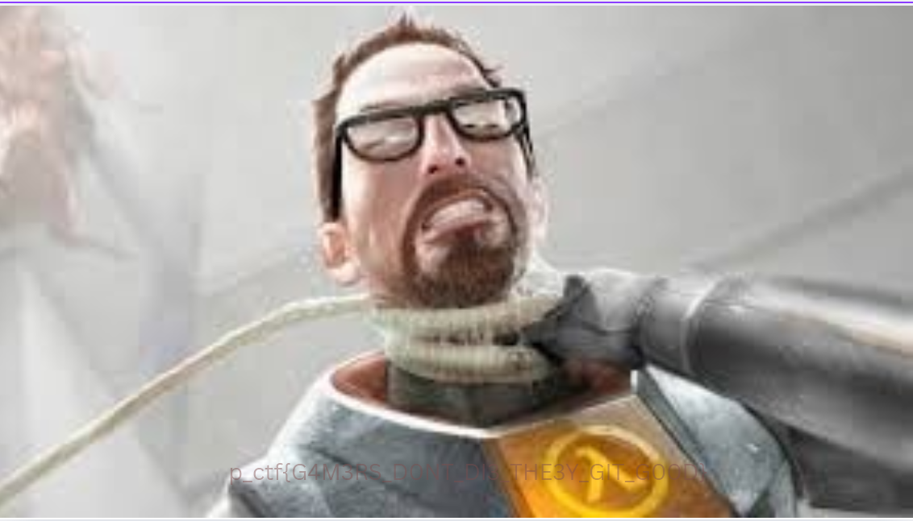

Initially we are given a file fullready.pdf
We run foremost on it 
And then we try finding attached files


```
sksai@Saislap:/mnt/c/Users/saisa/OneDrive/Desktop/chal4test$ foremost fullready.pdf
Processing: fullready.pdf
|*|
sksai@Saislap:/mnt/c/Users/saisa/OneDrive/Desktop/chal4test$ cd output/pdf/
sksai@Saislap:/mnt/c/Users/saisa/OneDrive/Desktop/chal4test/output/pdf$ pdfdetach -list 00000000.pdf
3 embedded files
1: Canyouhearthemusic.wav
2: hidden.pdf
3: starwars.wav
```

Now we try extracting them 

```
pdfdetach -saveall 00000000.pdf
```
Now we check hidden.pdf
And extract the attached files from it
```
sksai@Saislap:/mnt/c/Users/saisa/OneDrive/Desktop/chal4test/output/pdf$ pdfdetach -list hidden.pdf
2 embedded files
1: fincorrupt
2: mb2.ulz
sksai@Saislap:/mnt/c/Users/saisa/OneDrive/Desktop/chal4test/output/pdf$ pdfdetach -saveall hidden.pdf
```
The file fincorrupt cant be opened directly as it is corrupted
But its binary contains IHDR tags implying it is an image
We correct its png magic number using a hex editor
```
Hex Signature (Magic Number):
89 50 4E 47 0D 0A 1A 0A
```


This image hints towards XOR

Now from the other pdfs we got the following files
`
starwars.wav
`
`
mb2.ulz
`
`
test_chal4.bsp
`
(The other audio file is a fake :))


The wav file dosent seem to contain anything on the surface
But opening it in deepsound reveals it contains some hidden files
But it has been encrypted with a password

The mb2.ulz file is a USBlyzer data capture file
On Analysing it we find that it contains mouse input data

Next the test_chal4.bsp is a Binary space partitioning file for source engine games
The pdf file earlier hinted towards "Half-Life"
So we export the .bsp file map to half life and load it up

```Console

maps test_chal4.bsp
```

Then we export the mouse input data and use this script to simulate its motion in the map

```
const fs = require('fs');
const robot = require('robotjs');
const readline = require('readline');

const csvFilePath = 'mouse_data.csv';

// Read CSV file
const events = fs.readFileSync(csvFilePath, 'utf8').split('\n').filter(line => line);
console.log(`Loaded ${events.length} events from CSV file.`);

if (events.length === 0) {
    console.error("Error: No data found in CSV file!");
    process.exit(1);
}

// Readline interface for stopping the simulation
const rl = readline.createInterface({
    input: process.stdin,
    output: process.stdout
});

let stopSimulation = false;
let isLeftButtonDown = false; // Track left button state

const stop = () => {
    console.log("\n🛑 Stopping simulation...");
    stopSimulation = true;
    rl.close();
};

rl.on('line', (input) => {
    if (input === 'esc') stop();
});

// Function to parse a CSV line
const parseCSVLine = (line) => {
    const columns = line.split(',');
    if (columns.length < 8) return null; // Ignore malformed lines

    return {
        timestamp: parseFloat(columns[3]),  // Column 3 is event time
        eventType: columns[5].trim(),       // Column 5 is event type
        rawData: columns[7].trim()          // Column 7 is the raw mouse data
    };
};

// Function to convert byte value to signed integer (-128 to 127)
const toSignedInt = (byte) => {
    return byte > 127 ? byte - 256 : byte; // Convert unsigned to signed
};

// Replay function
const replayMouseEvents = async () => {
    let lastTimestamp = 0;

    // Get screen center
    const { width, height } = robot.getScreenSize();
    const centerX = width / 2;
    const centerY = height / 2;

    // Set the initial mouse position to the center of the screen
    robot.moveMouse(centerX, centerY);
    console.log(`🎯 Mouse initialized at center: (${centerX}, ${centerY})`);

    for (let i = 0; i < events.length; i++) {
        if (stopSimulation) return;

        const parsed = parseCSVLine(events[i]);
        if (!parsed) continue; // Skip invalid rows

        const { timestamp, eventType, rawData } = parsed;
        const delay = lastTimestamp ? (timestamp - lastTimestamp) * 1000 : 0; // Convert seconds to ms
        lastTimestamp = timestamp;

        if (!rawData || rawData.length < 8) continue; // Ignore empty or invalid raw data

        const bytes = rawData.split(' ').map(hex => parseInt(hex, 16));
        const buttons = bytes[0]; // First byte represents buttons
        const dx = toSignedInt(bytes[2]); // X movement (third byte)
        const dy = toSignedInt(bytes[4]); // Y movement (fifth byte)

        console.log(`⏳ Processing event ${i + 1}/${events.length}:`);
        console.log(`   Timestamp: ${timestamp}`);
        console.log(`   Event Type: ${eventType}`);
        console.log(`   Raw Data: ${rawData}`);
        console.log(`   🖱️ Moving mouse by (${dx}, ${dy})`);

        // Move the mouse
        const { x, y } = robot.getMousePos();
        robot.moveMouse(x + dx, y + dy);

        // Handle mouse clicks
        if (buttons & 1) { // Left button pressed
            if (!isLeftButtonDown) {
                robot.mouseToggle("down", "left");
                isLeftButtonDown = true;
                console.log("   🖱️ Left button PRESSED");
            }
        } else { // Left button released
            if (isLeftButtonDown) {
                robot.mouseToggle("up", "left");
                isLeftButtonDown = false;
                console.log("   🖱️ Left button RELEASED");
            }
        }

        // Delay for synchronization
        await new Promise(resolve => setTimeout(resolve, delay));
    }

    console.log("\n✅ Mouse event replay completed.");
};

// Start replaying after 5 seconds
console.log("\n⏳ Waiting 5 seconds before starting...");
console.log("🔴 Press 'esc' to stop the simulation at any time...");
setTimeout(() => {
    console.log("\n▶️ Starting to replay mouse events...");
    replayMouseEvents();
}, 5000);

```

But the map dosent have any weapons
And as hinted by the pdf we use the cheat 

```
impulse 101
```

And we follow the hint in the question to not let bullets run out and use tau gun

And we get the password 










#### youBREAK47PASSTHE

This password can be used to get the secret file embedded in the starwars.wav using deepsound
Inside we find another image



So now we have both of the images to XOR
XORing them gives us the flag

```
from PIL import Image
import numpy as np

# Load the XORed image and the cover image
xor_img = Image.open('xor_image.png').convert('RGB')
cover_img = Image.open('fin.png').convert('RGB')

# Resize the cover image to match the XORed image if necessary
if xor_img.size != cover_img.size:
    cover_img = cover_img.resize(xor_img.size)

xor_array = np.array(xor_img)
cover_array = np.array(cover_img)

original_flag_array = np.bitwise_xor(xor_array, cover_array)

original_flag_img = Image.fromarray(original_flag_array)
original_flag_img.save('recovered_flag.png')

print("Flag recovery complete! Saved as recovered_flag.png.")
```


And theres the Flag !
`
 p_ctf{G4M3RS_D0NT_DI3_TH3Y_GIT_G00D}
 `
