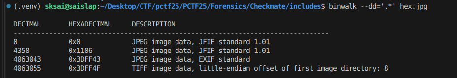
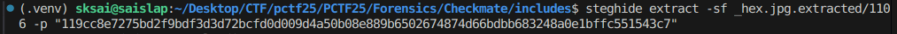
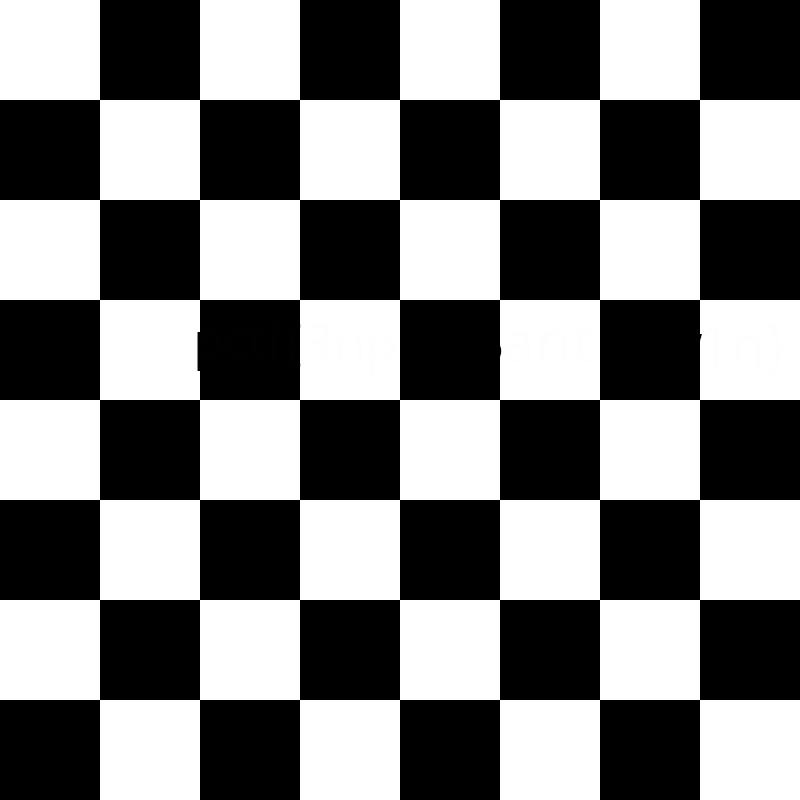
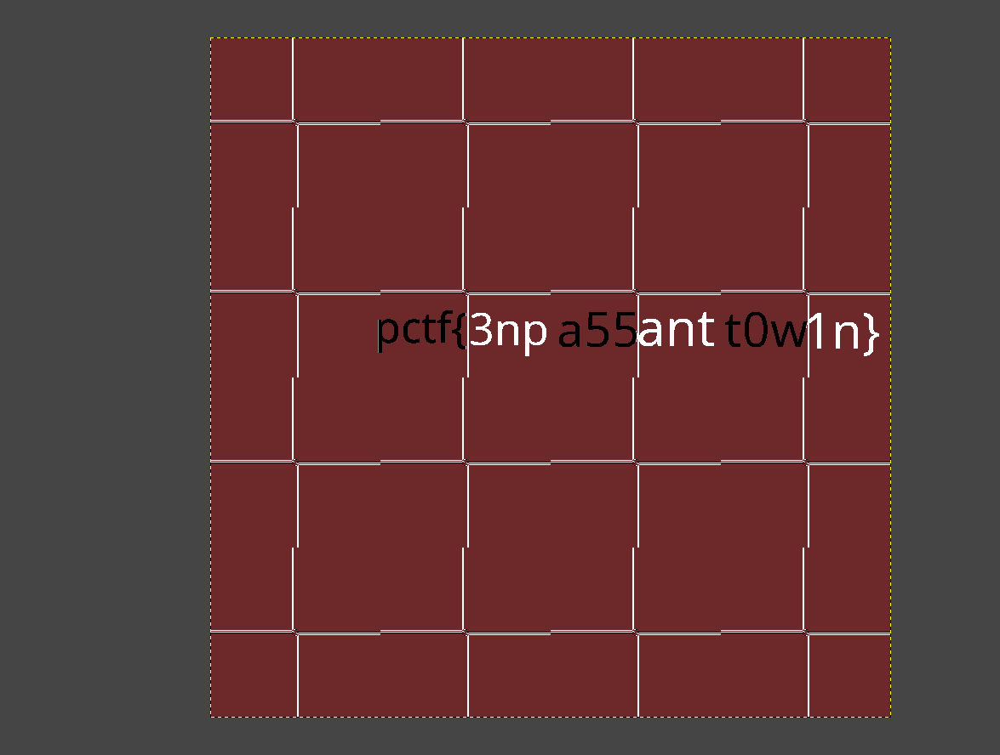

# CHECKMATE - WRITEUP

Initally, we are given an image hex.jpg
We check the strings of hex.jpg and find "The Game of The Century"

```
strings hex.jpg
```

On analysis of the given image using binwalk we find 2 JPG files


```
binwalk --dd='.*' hex.jpg
```


The pigeon image hints towards the pgn notation of the "Game of the Century"

```
[Event "Third Rosenwald Trophy"]
[Site "New York, NY USA"]
[Date "1956.10.17"]
[EventDate "1956.10.07"]
[Round "8"]
[Result "0-1"]
[White "Donald Byrne"]
[Black "Robert James Fischer"]
[ECO "D92"]
[WhiteElo "?"]
[BlackElo "?"]
[PlyCount "82"]

1. Nf3 Nf6 2. c4 g6 3. Nc3 Bg7 4. d4 O-O 5. Bf4 d5 6. Qb3 dxc4
7. Qxc4 c6 8. e4 Nbd7 9. Rd1 Nb6 10. Qc5 Bg4 11. Bg5 {11. Be2
followed by 12. O-O would have been more prudent. The bishop
move played allows a sudden crescendo of tactical points to be
uncovered by Fischer. -- Wade} Na4 {!} 12. Qa3 {On 12. Nxa4
Nxe4 and White faces considerable difficulties.} Nxc3 {At
first glance, one might think that this move only helps White
create a stronger pawn center; however, Fischer's plan is
quite the opposite. By eliminating the Knight on c3, it
becomes possible to sacrifice the exchange via Nxe4 and smash
White's center, while the King remains trapped in the center.}
13. bxc3 Nxe4 {The natural continuation of Black's plan.}
14. Bxe7 Qb6 15. Bc4 Nxc3 16. Bc5 Rfe8+ 17. Kf1 Be6 {!! If
this is the game of the century, then 17...Be6!! must be the
counter of the century. Fischer offers his queen in exchange
for a fierce attack with his minor pieces. Declining this
offer is not so easy: 18. Bxe6 leads to a 'Philidor Mate'
(smothered mate) with ...Qb5+ 19. Kg1 Ne2+ 20. Kf1 Ng3+
21. Kg1 Qf1+ 22. Rxf1 Ne2#. Other ways to decline the queen
also run into trouble: e.g., 18. Qxc3 Qxc5} 18. Bxb6 Bxc4+
19. Kg1 Ne2+ 20. Kf1 Nxd4+ {This tactical scenario, where a
king is repeatedly revealed to checks, is sometimes called a
"windmill."} 21. Kg1 Ne2+ 22. Kf1 Nc3+ 23. Kg1 axb6 24. Qb4
Ra4 25. Qxb6 Nxd1 26. h3 Rxa2 27. Kh2 Nxf2 28. Re1 Rxe1
29. Qd8+ Bf8 30. Nxe1 Bd5 31. Nf3 Ne4 32. Qb8 b5 {Every piece
and pawn of the black camp is defended. The white queen has
nothing to do.} 33. h4 h5 34. Ne5 Kg7 35. Kg1 Bc5+ 36. Kf1
Ng3+ {Now Byrne is hopelessly entangled in Fischer's mating
net.} 37. Ke1 Bb4+ 38. Kd1 Bb3+ 39. Kc1 Ne2+ 40. Kb1 Nc3+
41. Kc1 Rc2# 0-1
```


The question hints towards chess and encryption
https://github.com/WintrCat/chessencryption

So we try to decode the pgn file based on this and get the binary value

```
from time import time
from math import log2
from chess import pgn, Board
from util import get_pgn_games


def decode(pgn_string: str, output_file_path: str):
    start_time = time()

    total_move_count = 0

    # load games from pgn file
    games: list[pgn.Game] = get_pgn_games(pgn_string)

    # convert moves to binary and write to output file
    with open(output_file_path, "w") as output_file:
        output_file.write("")

    output_file = open(output_file_path, "ab")
    output_data = ""

    for game_index, game in enumerate(games):
        chess_board = Board()

        game_moves = list(game.mainline_moves())
        total_move_count += len(game_moves)

        for move_index, move in enumerate(game_moves):
            # get UCIs of legal moves in current position
            legal_move_ucis = [
                legal_move.uci()
                for legal_move in list(chess_board.generate_legal_moves())
            ]

            # get binary of the move played, using its index in the legal moves
            move_binary = bin(
                legal_move_ucis.index(move.uci())
            )[2:]

            # if this is the last move of the last game,
            # binary cannot go over a total length multiple of 8
            if (
                game_index == len(games) - 1 
                and move_index == len(game_moves) - 1
            ):
                max_binary_length = min(
                    int(log2(
                        len(legal_move_ucis)
                    )),
                    8 - (len(output_data) % 8)
                )
            else:
                max_binary_length = int(log2(
                    len(legal_move_ucis)
                ))

            # Pad move binary to meet max binary length
            required_padding = max(0, max_binary_length - len(move_binary))
            move_binary = ("0" * required_padding) + move_binary

            # play move on board
            chess_board.push_uci(move.uci())

            # add move binary to output data string
            output_data += move_binary

            # if output binary pool is multiple of 8, flush it to file
            if len(output_data) % 8 == 0:
                output_file.write(
                    bytes([
                        int(output_data[i * 8 : i * 8 + 8], 2)
                        for i in range(len(output_data) // 8)
                    ])
                )
                output_data = ""

    print(
        "\nsuccessfully decoded pgn with "
        + f"{len(games)} game(s), {total_move_count} total move(s)"
        + f"({round(time() - start_time, 3)}s)."
    )

```

```
successfully decoded pgn with 1 game(s), 82 total move(s)(0.008s).
b"\x11\x9c\xc8\xe7'[\xd2\xf9\xbd\xf3\xd3\xd7+\xcf\xd0\xd0\t\xd4\xa5\x0b\x08\xe8\x89\xb6P&t\x87Mf\xbd\xbbh2H\xa0\xe1\xbf\xfcU\x15C\xc7"
119cc8e7275bd2f9bdf3d3d72bcfd0d009d4a50b08e889b6502674874d66bdbb683248a0e1bffc551543c7
```

We convert the binary to its hexadecimal notation as hinted by the image name. Then we use steghide to extract the hidden data from the other image.
```
steghide extract -sf _hex.jpg.extracted/1106 -p "119cc8e7275bd2f9bdf3d3d72bcfd0d009d4a50b08e889b6502674874d66bdbb683248a0e1bffc551543c7"
```



On extraction we get an image rly_fin.jpg 

On examining the metadata we find that rly_fin.jpg has an Author: BobbyFischer 

```
exiftool rly_fin.jpg

Author                          : BobbyFischer

```

We use binwalk and find that rly_fin.jpg also contains a ZIP file. The ZIP file is password Protected , so we try the password "BobbyFischer"
```
binwalk --extract rly_fin.jpg

unzip -P BobbyFischer _rly_fin.jpg.extracted/AFE1.zip
```
We find 64 images in a folder named chess_squares, they are all black and white squares so we try and join them
in the form of a chess board
```
from PIL import Image
import os

input_dir = "chess_squares"
images = []

image_files = sorted(os.listdir(input_dir))

for image_file in image_files:
    img_path = os.path.join(input_dir, image_file)
    try:
        img = Image.open(img_path)
        images.append(img)
        print(f"Loaded {image_file}")
    except Exception as e:
        print(f"Failed to load {image_file}: {e}")

square_size = images[0].size

chessboard = Image.new('RGB', (8 * square_size[0], 8 * square_size[1]))

for row in range(8):
    for col in range(8):
        img = images[row * 8 + col]
        chessboard.paste(img, (col * square_size[0], row * square_size[1]))

output_path = "chess_board_combined.png"
chessboard.save(output_path)
print(f"Chessboard image saved as {output_path}")

```
We have ourselves a chess board now , we see something which looks like a text in the center of board of slightly different shade



We use GIMP and try colour exchage (Colours -> Map -> Colour exchange)

And we have our flag


