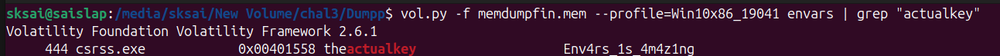
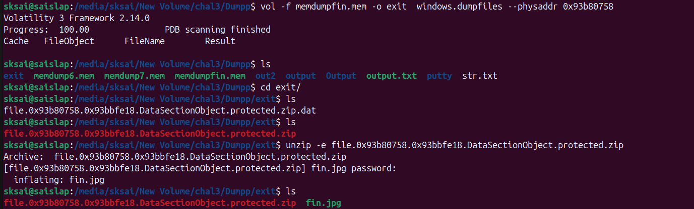

Initially we are given the compressed memory dump
We decompress it 
```
xz -d memdumpfin.mem.xz
```

We first find the right profile 

```
vol.py -f memdumpfin.mem imageinfo

profile=Win10x86_19041
```

The question mentions a protected archive and a certain script
First we try finding the archive
```
vol -f memdumpfin.mem windows.filescan | grep "protected"
```


Next we try finding the script

```
vol -f memdumpfin.mem windows.filescan | grep "script.py"
```


We try to get the contents of the script
```
vol -f memdumpfin.mem -o exit windows.dumpfiles --virtaddr 0xa79e8af0

cat exit/file.0xa79e8af0.0xa7309e40.DataSectionObject.script.py.dat 


```


This python script seems to be using a cryptographic key to decode some input
We try searching the environment variables for the actual key

```
vol.py -f memdumpfin.mem --profile=Win10x86_19041 envars | grep "actualkey"

```



And the 'PASSKEY' was apparently sent over the internet
So we try using netscan to check which process could have done it

```
vol.py -f memdumpfin.mem --profile=Win10x86_19041 netscan

```


Here powershell seems suspicious
So we try dumping its memory and finding the "PASSKEY"

```
vol -f memdumpfin.mem -o exit windows.memmap --dump --pid 6208

strings pid.6208.dmp | grep "PASSKEY"

```


Upon running the python script with the real Cryptographic key and input
We get this link


https://drive.google.com/file/d/1GAdxu8g01q7FEWvVkc4vqFQovLLh1r3E/view?usp=drive_link


This leads to a gif
It seems to contain symbols per frame which are actually in morse code


So we manually decrypt it and get

```
Openthisfilesesame
```


So now we extract the protected.zip file

```
vol -f memdumpfin.mem -o exit windows.dumpfiles --virtaddr 0xb7e5920
```



And we try this password to open the protected.zip file

And we find an image fin.jpg inside

```
cp file.0xb7e5f920.0xb77e9d38.DataSectionObject.protected.zip.dat protected.zip

unzip -e protected.zip -p Openthisfilesesame
```


The gif we found was named "MaliciousProgram.gif"
So we try finding this Malicious program

```
vol.py -f memdumpfin.mem --profile=Win10x86_19041 malfind
```


This ks.exe seems suspicous
Lets try looking for the password here

```
vol -f memdumpfin.mem -o exit  windows.memmap --dump --pid 6096

strings pid.6096.dmp | grep "Password"

```


Thus we have our password
Decoding the base64 we get
```
Password{Y0u_m4y_pa55}
```
We try using steghide to extract any hidden secrets


And voila
there's our flag

```
p_ctf{Th3fla4gsureisV0latil3}
```
