# Operation-Cypherlock Writeup

Initally we are given a pcapng file- broken_transmission.pcapng
On trying to open it we find that it is corrupted

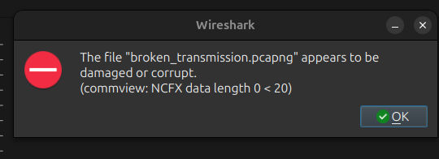

Opening the file with any hexeditor we find that the magic number of the file has been changed to 00 00 00 00

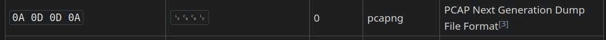

So we change it to 0A 0D 0D 0A
And the file is repaired and valid

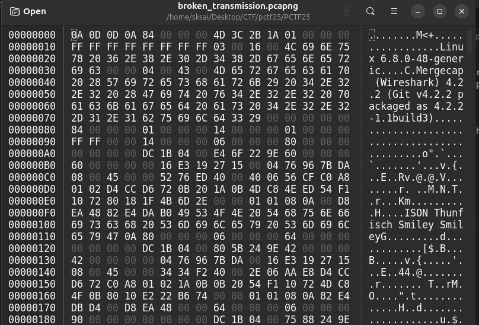

Open the file using wireshark and set the display filter as smtp to view the necessary data


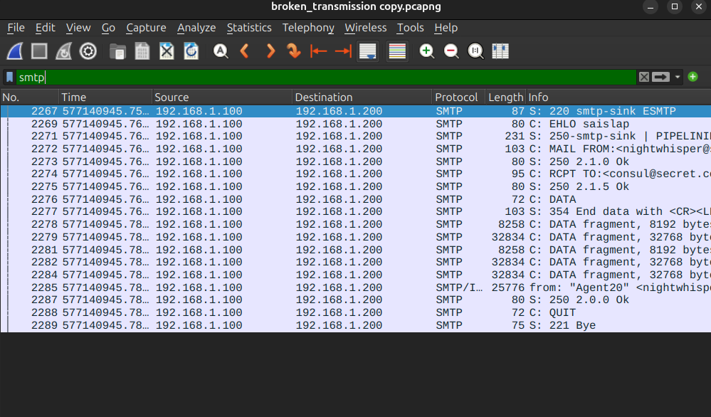


Now follow the stream to view the transmitted email

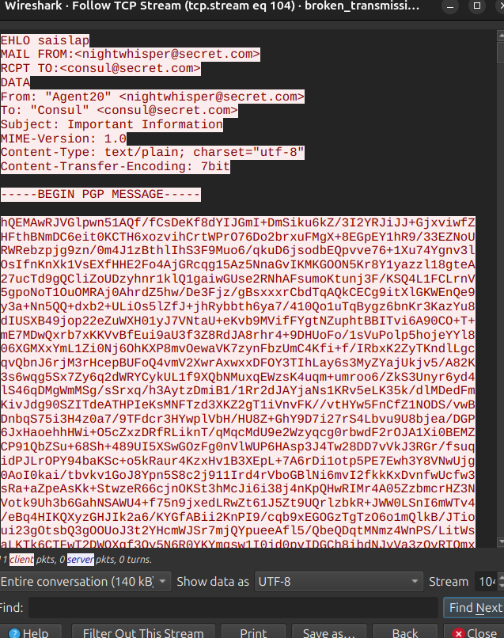

We find a secret message encrypted using PGP
So we need its private key to decrypt it


Now looking through the packets again we find out that few of them have comments

```
1{https://drive.google.com}

2{/drive/folders/1dxvbp6CIy}

3{f40oahwtkRBbPzfC6PQkaKi}
```

Joining them we get a Google drive link 

<https://drive.google.com/drive/folders/1dxvbp6CIyf40oahwtkRBbPzfC6PQkaKi>

We find 2 files

bruh.zip
imagee.png

We try bruteforcing the password protected zip

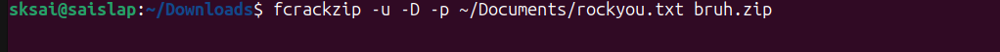

we find the password as ABCD1234abcd

unzip the file using the password

```
unzip -P ABCD1234abcd brute.zip
```

We find a folder named 'somerandom' and a file - Bruhhh inside it
It seems to contain multiple A's and B's which points towards Baconian cipher
Decrypting it gives the private key
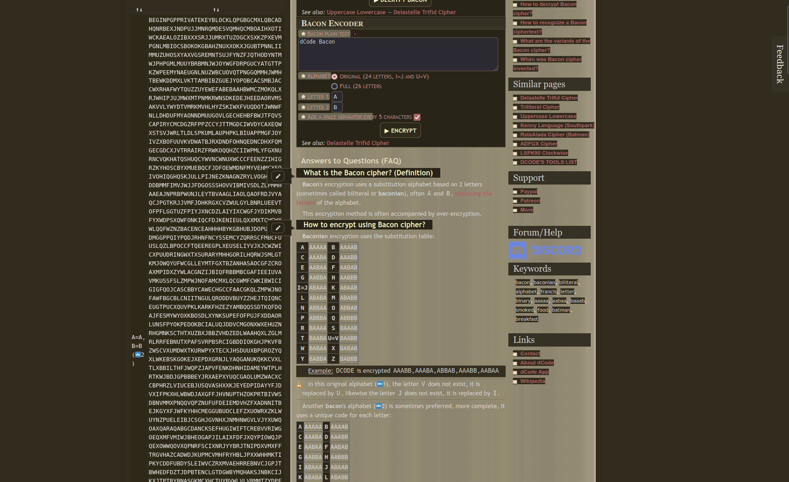
Add the private key to your GPG keyring using the following command:

```
gpg --import private.key
```

Now, save the encrypted PGP message from the email to a file, for example, `message.pgp`. Then, decrypt the message using the following command:

``` 
gpg --decrypt message.pgp > decrypted_message
```
You should now see the decrypted message
It is of some unknown format

```
file decrypted_message
```
```
decrypted_message: RIFF (little-endian) data, WAVE audio, Microsoft PCM, 16 bit, mono 44100 Hz

```

So it a .wav file

Now there was another file

imagee.png

Reverse search of the image points to "Radioteletype"

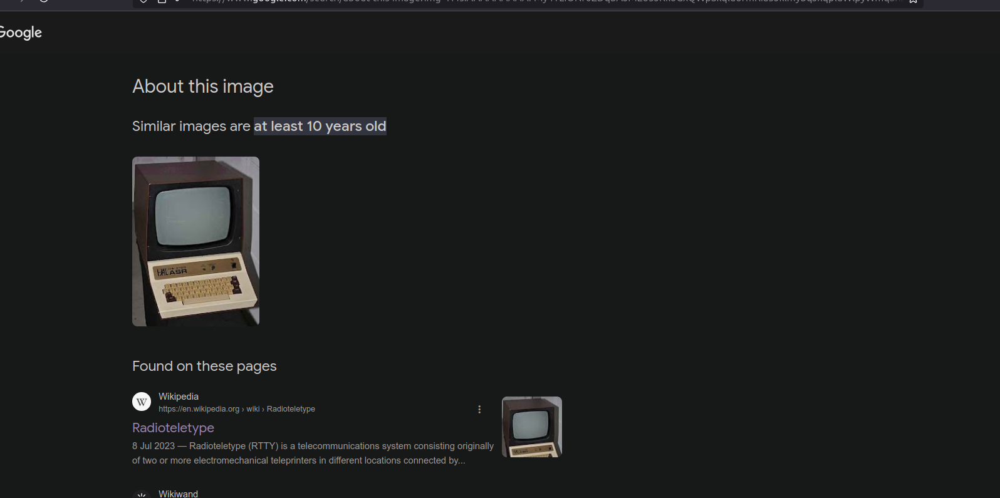

So we can conclude that the audio file contains RTTY signals

Going through the metadata of the image we find its bit duration
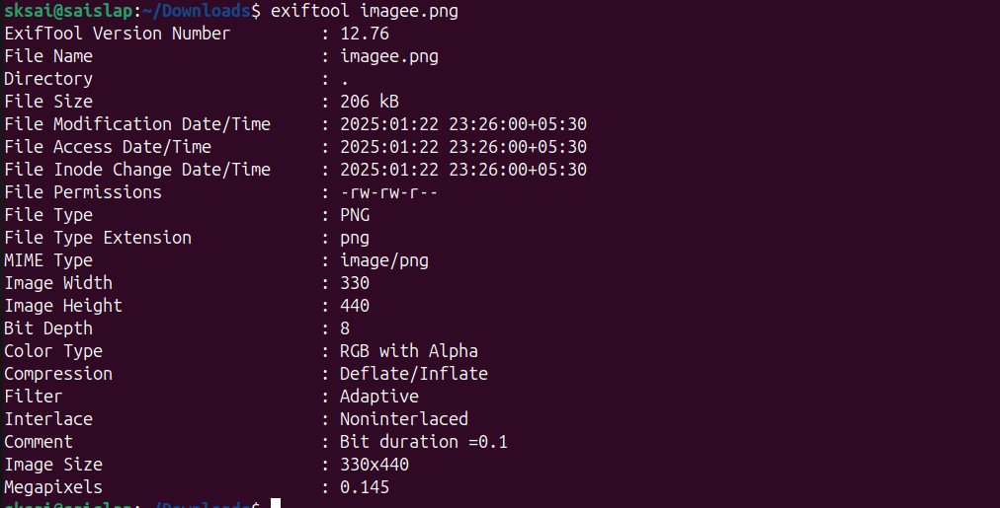

And checking the exifdata of the audio file gives us its Sample rate

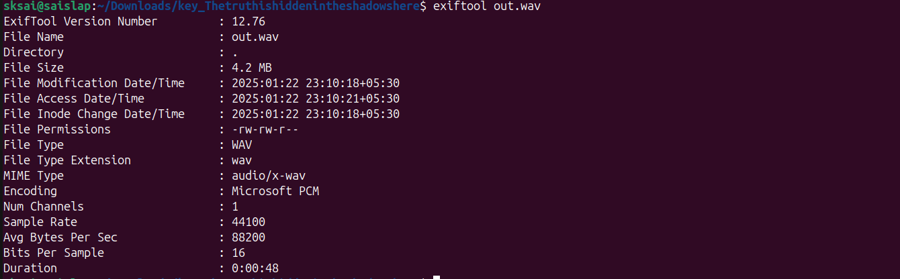

We then try using them along with the standard mark and space frequencies of RTTY encoding

```
Hertz
mark = 2125  
space = 2295
rate= 44100
baud rate=10

```
We can use this to decrypt the radio transmission
we run the following code
```
import numpy as np
from scipy.io import wavfile

# Parameters
mark_freq = 2125  # Hz
space_freq = 2295  # Hz
sample_rate = 44100  # Hz
bit_duration = 0.1  # seconds (100 ms per bit)

def decode_rtty(file_path):
    sample_rate, audio = wavfile.read(file_path)
    binary_data = ""
    for i in range(0, len(audio), int(bit_duration * sample_rate)):
        chunk = audio[i:i+int(bit_duration * sample_rate)]
        freqs = np.fft.fftfreq(len(chunk), d=1/sample_rate)
        fft_values = np.fft.fft(chunk)
        dominant_freq = abs(freqs[np.argmax(np.abs(fft_values))])
        if abs(dominant_freq - mark_freq) < abs(dominant_freq - space_freq):
            binary_data += "1"
        else:
            binary_data += "0"
    message = ""
    for i in range(0, len(binary_data), 8):
        byte = binary_data[i:i+8]
        message += chr(int(byte, 2))
    
    return message

message = decode_rtty("rtty_output.wav")
print("Decoded Message:", message)

```
 We get
 Decoded Message: 42c74ddaa38b290bd0cae53d79a1b8eca8300ccec20e991cbd67fdd111b2

 This seems to be some sort of cipher,
 from the hints in the question about AgentJohnny and AgentPacheco we relate it to Salsa
 (Johnny Pacheco was a leading figure in the Salsa scene)
 We can conclude that this is a Salsa20 cipher
 Its key must be hidden somewhere..

Browsing through the bit planes of the imagee.png we find the key

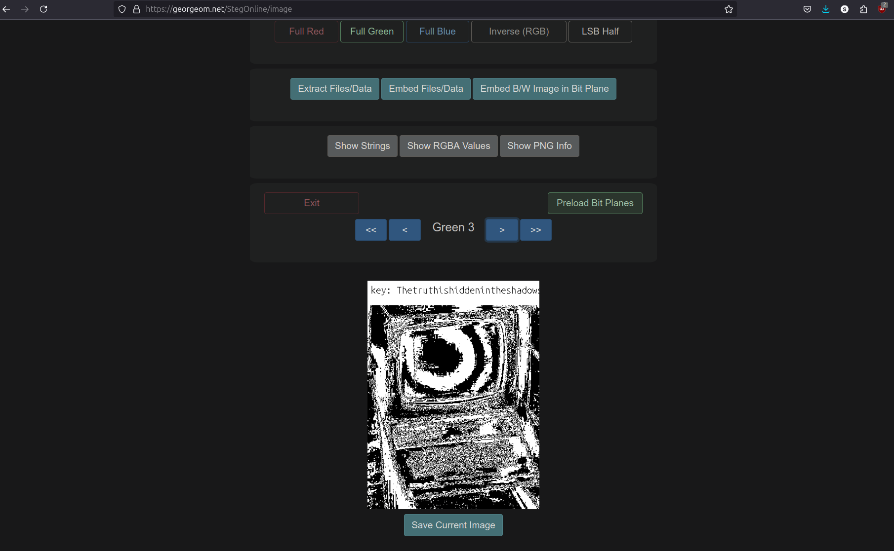


key: Thetruthishiddenintheshadowshere

Upon checking the readable strings of brute.zip we find its nonce at the end
```
strings brute.zip
```

Nonce: 3b59ce9e490508e4f37672a7ac71fb0c1c58dc01928120db

We use this to find the flag

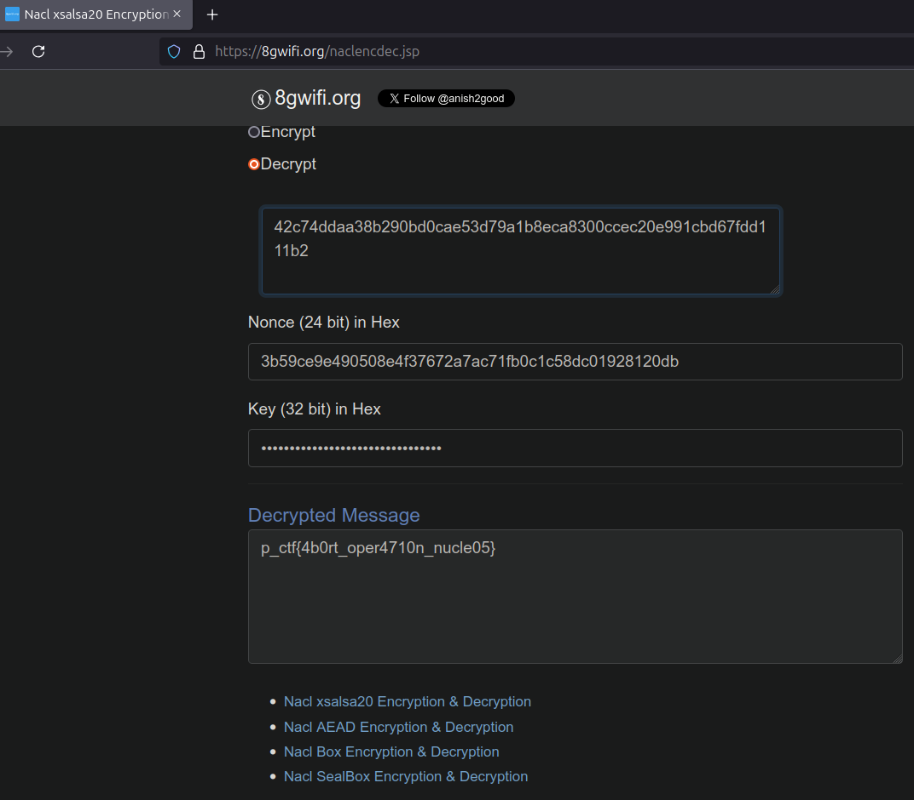
