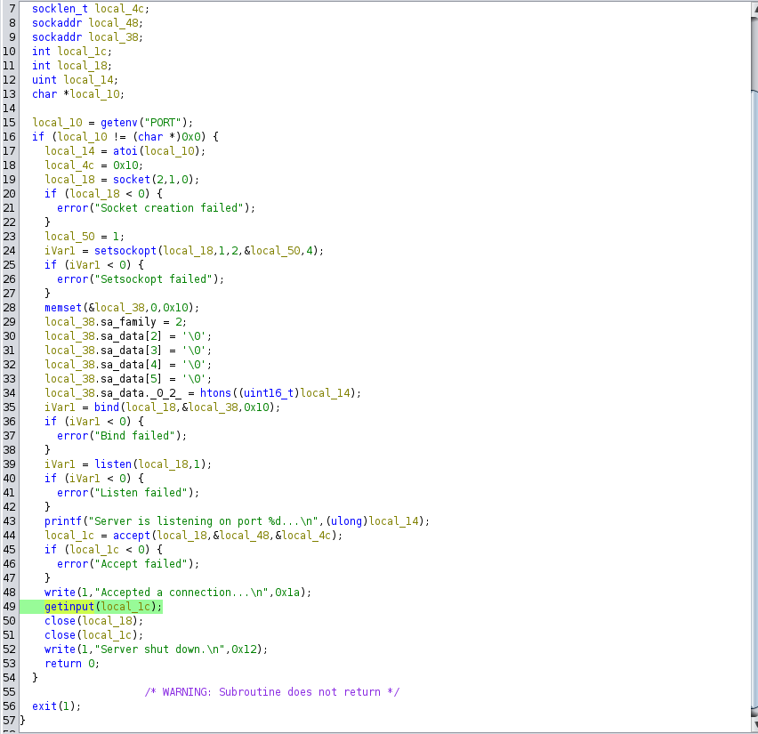
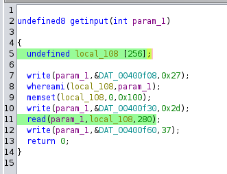
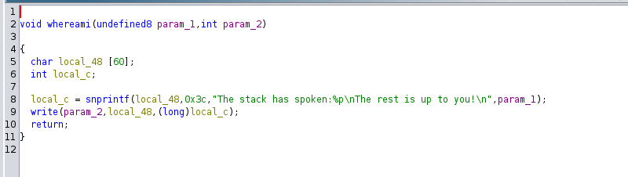
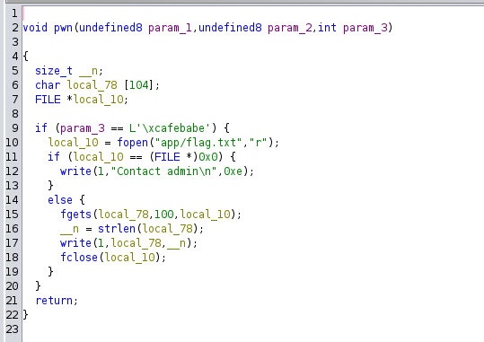
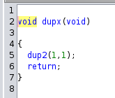

# Dupocalypse

## Challenge Analysis

The challenge provides a custom socket application, which retrieves a port from the environment and starts listening for incoming connections. On accepting a connection, it creates a new file descriptor and passes it to the `getinput` function.

## Main Function Analysis

Disassembling the binary in Ghidra, we observe that the `main` function:
- Initializes a socket and binds it to a port.
- Accepts a connection, creating a new file descriptor.
- Passes the new file descriptor to the `getinput` function.



## Stack Overflow in `getinput`

Within the `getinput` function:
- A 256-byte array is allocated on the stack.
- The address of this array is passed to `whereami`.
- `whereami` prints the address of the buffer.
- The function then reads **280 bytes** into the array, causing a **24-byte overflow**.



## `whereami` Function

The `whereami` function simply prints the address of the buffer. This provides a crucial **stack leak**, helping us pivot the stack during exploitation.



## The `pwn` Function



Another function of interest is `pwn`, which checks the **third parameter (rdx)**. If it equals `0xcafebabe`, it prints the flag.

## Exploitation Strategy

Given the **24-byte overflow**, we have **control over RIP** but cannot do much directly. The overflow consists of:
- **8 bytes for saved RBP**
- **8 bytes for the return address**

### Stack Pivoting

A useful **ROP gadget** is present:
```assembly
pop rsp ; pop r13 ; pop r14 ; pop r15 ; ret
```
This allows us to redirect execution to a location we control.

### Controlling `rdx` with Ret2CSU

The challenge includes a CSU initialization function, which provides a useful gadget:
```assembly
mov rdx, r15
mov rsi, r14
mov edi, r13d
call qword ptr [r12+rbx*8]
ret
```
To call `pwn(rdx=0xcafebabe)`, we:
1. Set `r15 = 0xcafebabe` (which moves to `rdx`).
2. Set `r12 = pwn` and `rbx = 0` (ensuring `call [r12 + rbx*8]` calls `pwn`).

### Redirecting Flag Output

The `pwn` function prints to `stdout` (fd = 1). However, since we are connected via a different file descriptor, we won’t see the flag unless we redirect the output.

### Using `dup2`

The binary contains a `dupx` function, which internally calls `dup2`. The `dup2(oldfd, newfd)` syscall redirects one file descriptor to another.



By calling:
```c
dup2(1, sockfd)
```
We ensure that `stdout` is redirected to our socket, allowing us to receive the flag.

## Final Payload

We construct the exploit as follows:
```python
pay = flat(
    PWN,
    0, 0, 0,                                # r13, r14, r15
    POP_RDI, 4,                             # rdi = socket fd
    POP_RSI, 1, 0,                          # rsi = stdout, r15 (unused)
    DUP,                                    # Call dup2(sockfd, 1)
    POP_R, 0, 0, addr, 0, 0, 0xcafebabe,    # Set up Ret2CSU for calling pwn
    CSU_GAD                                 # Call pwn
)

pay = pay.ljust(264, b'A')

pay += flat(
    POP_RSP,
    addr+8
)
```

### Explanation:

1. Set up file descriptor redirection using `dup2`.
2. Use **Ret2CSU** to set `rdx = 0xcafebabe` and call `pwn`.
3. Pivot the stack using `pop rsp` to gain control over execution.
4. Trigger execution of `pwn`, ensuring the flag is printed to our socket.

## Final Exploit

The complete exploit is available in [solve.py](solve.py)

