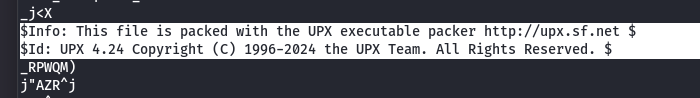
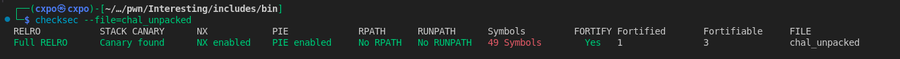
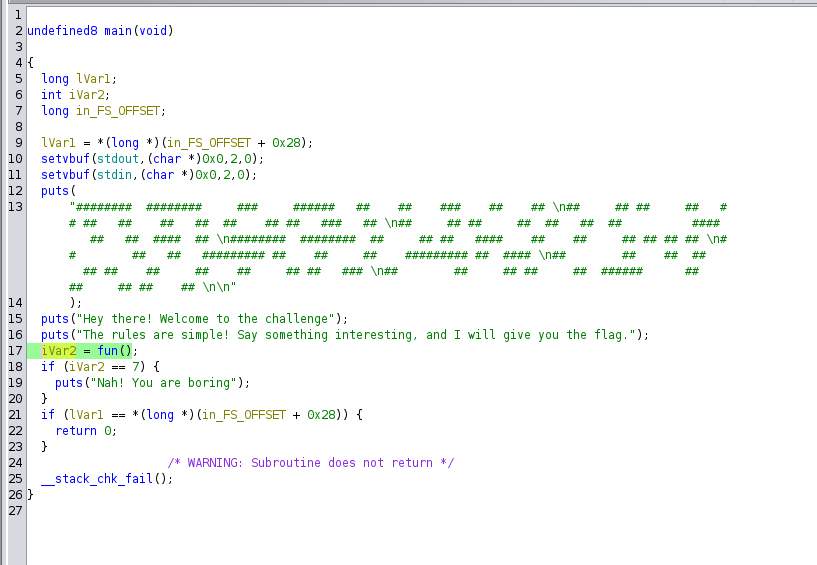
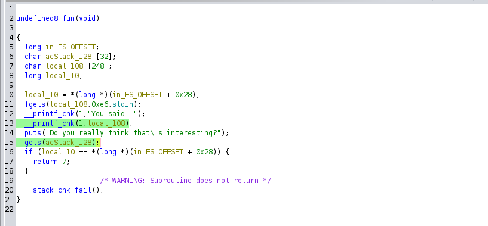
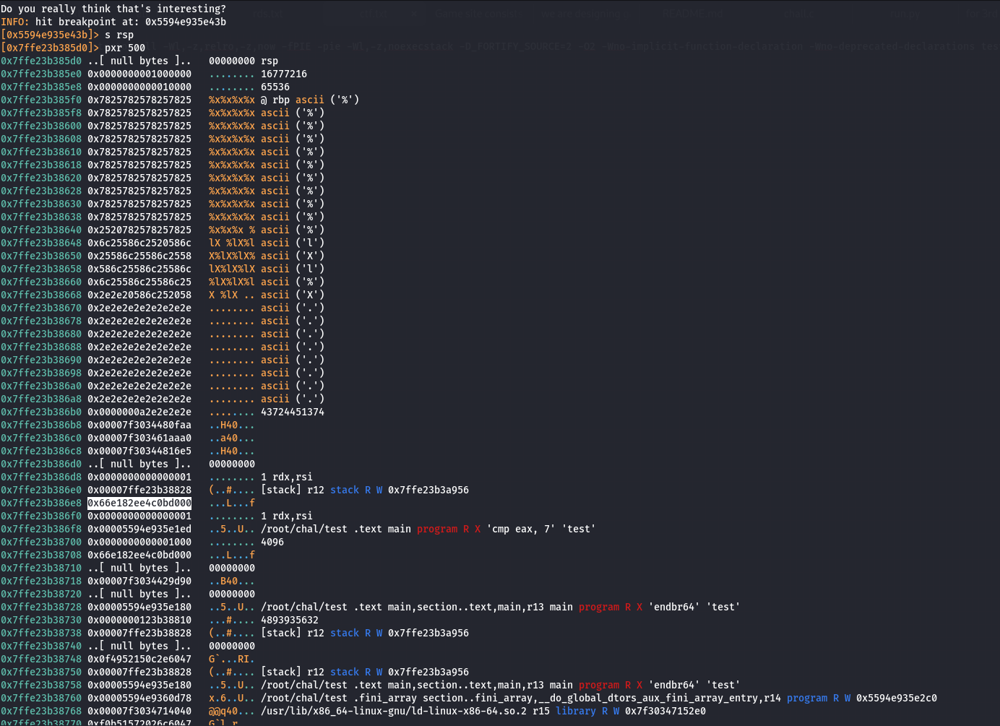
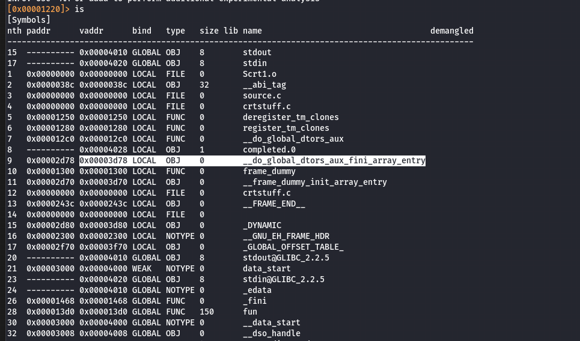
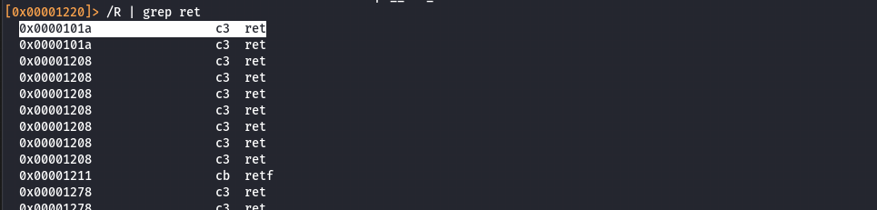
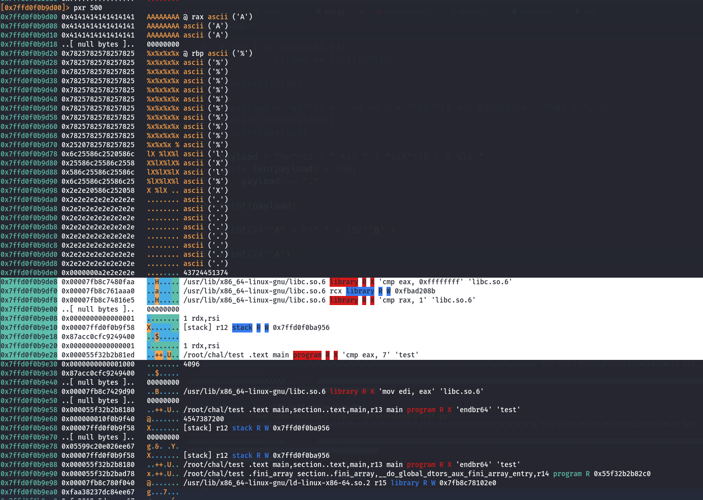

## Intetersting

### Step 1: Identifying the Packed Binary  
When you run `strings` on the binary:



It reveals that the binary is packed with **UPX**. To proceed with the analysis, we need to unpack it. Use the following command:

```sh
upx -d chal -o chal_unpacked
```

>__**UPX** Repo__ :  https://github.com/upx/upx. Or you can directly download it from [here](https://github.com/upx/upx/releases/download/v4.2.4/upx-4.2.4-amd64_linux.tar.xz)

### Step 2: Running `checksec`  
After unpacking the binary, running `checksec` gives us the following output:



- **Stack Canary**, **PIE**, and **NX** are all enabled, adding security layers to the binary.

### Step 3: Analyzing the Binary in Ghidra  
Opening the binary in **Ghidra** reveals three functions:  
- `main`
- `fun`
- `interesting`



- The `main` function calls the `fun` function:



In the `fun` function, we observe **two vulnerabilities**:  
1. **Format String Vulnerability**  
2. **Buffer Overflow Vulnerability**  

The **interesting** function is responsible for printing the flag. The goal is to exploit the **format string vulnerability** to leak the **canary** and **base address**, and then perform a **buffer overflow** to overwrite the return address of `fun` to point to the `interesting` function. We need to place the canary correctly to bypass the **stack-smashing check**.

### Step 4: Extracting Canary and Base Address  
Using `radare2`, we find the **canary** location in the stack:



- Also we cannot use `%$Nx` arguments because newer versions of glibc (>= 2.31) include stricter checks (`*** invalid %N$ use detected ***`) for format string specifiers to prevent exploitation.

- By experimenting with different format string arguments, we determine that the canary is at the **44th argument**

- Additionally, the address of `__do_global_dtors_aux_fini_array_entry` is found on the stack.  
- To find the **base address**, we subtract the **static address** from the **dynamic address**.

From further analysis, we see that `__do_global_dtors_aux_fini_array_entry` is at the **55th argument**

We can find the **base address** by inspecting the symbols:





### Step 5: Crafting the Payload  
To overwrite the return address and redirect execution to the `interesting` function, we need to understand the stack layout. The following components exist:  
- **24 bytes**:  Buffer
- **8 bytes**: Padding
- **200 bytes**: Previous buffer  
- **48 bytes**: Padding
- **8 bytes**: Canary  
- **8 bytes**: Padding
- **8 bytes**: Return gadget
- **8 bytes**: Fun address

So, the payload will be:  
```python
payload = 24*b"A" + 8*b"." + 200*b"B" + 48*b"C" + p64(canary) + 8*b"." + p64(ret) + p64(fun_addrs)
```
__Note__ : `ret` gadget is added for stack alignment



The **address of the interesting function** can be found by adding the **base address** to the **static address** of the function.

### [Exploit Script](solve.py) 
