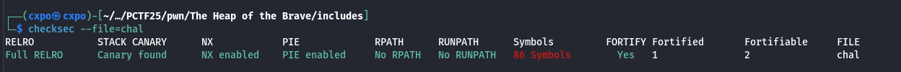

# Heap of the Brave

## Challenge Overview

This challenge is based on the **House of Einherjar** technique, which manipulates the heap's metadata to deceive the allocator.

## Challenge Description

When you run the binary, the following interaction is presented:

```
Welcome, warrior! The Gates of Valhalla await!
Ancient memory is located at 0x564421669010

--- Gates of Valhalla ---
1. Summon a warrior (Allocate memory)
2. Send to Valhalla (Free)
3. Bestow power (Write)
4. Prove your worth (Check the win condition)
5. Retreat (Exit)
-------------------------
[*] Choose your fate:1
[*] Maximum strength is 128 units.
[+] Choose the strength of the warrior:95
[*] Warrior summoned at 0x564421669f20

--- Gates of Valhalla ---
1. Summon a warrior (Allocate memory)
2. Send to Valhalla (Free)
3. Bestow power (Write)
4. Prove your worth (Check the win condition)
5. Retreat (Exit)
-------------------------
[*] Choose your fate:3
[*] Enter -1 to bestow power on the ancient memory.
[+] Choose the warrior to empower (-1 to 2):  
```

The binary allows memory allocation, freeing, and writing. It also allows to write the static array. The goal is to manipulate the heap allocator to achieve a win condition hidden in the code.

## Security Analysis

Using `checksec`, you can see that all common mitigations are enabled:



An analysis of the binary in Ghidra reveals the following functions: `menu`, `alloc`, `nuke`, `scribble`, and `win`.


The **main function** allocates a chunk of 48 bytes. The fifth element of the chunk is compared to a hardcoded value. If it matches, the `win` function is triggered.

## Objective

The challenge is to trick the allocator into assigning a chunk to a fake address where the hardcoded value has been pre-written. The binary is set up with Ubuntu 16.04 and `libc-2.23`.

## Heap Structure Analysis

Here’s a breakdown of allocated and freed chunks:

#### Credit: Azeria Labs

Allocated Chunk:


Freed Chunk:


> To learn more about Heap Implementation, read the [article](https://azeria-labs.com/heap-exploitation-part-1-understanding-the-glibc-heap-implementation/)

## Strategy

The strategy involves:

1. **Allocate two contiguous chunks** by selecting the sizes carefully.
2. Leverage the **static array** to create a fake chunk. This fake chunk must have correct metadata and the target hardcoded value to trigger the win.
3. The `scribble` function writes 8 extra bytes beyond the requested size to overflow the first chunk. This enables overwriting the metadata of the second chunk.
   
   

## Steps to Exploit

1. **Create Fake Chunk**: Use the array to create a fake chunk by writing the appropriate metadata and the target hardcoded value. We set our fwd and bck pointers to point at the fake_chunk in order to pass the unlink checks

2. **Overflow to Set Metadata**: Use `scribble` to overflow the first chunk. Modify the second chunk's metadata:
   - Change the **chunk size** appropriately to unset the "previous chunk in use" flag without affecting other metadata. (For example, if the chunk size is `0x101`, it can be set to `0x100` )
   - Set the **prev size** to the distance between the chunk and the array. This convinces `malloc` that the previous chunk is at the fake chunk's address.

3. **Free and Consolidate**: Once the second chunk is freed, `malloc` consolidates based on the manipulated metadata. Since the "previous chunk in use" flag is now clear, the allocator believes the previous chunk includes the fake chunk, adding it to the bin list.

## [Exploit Script](solve.py)

